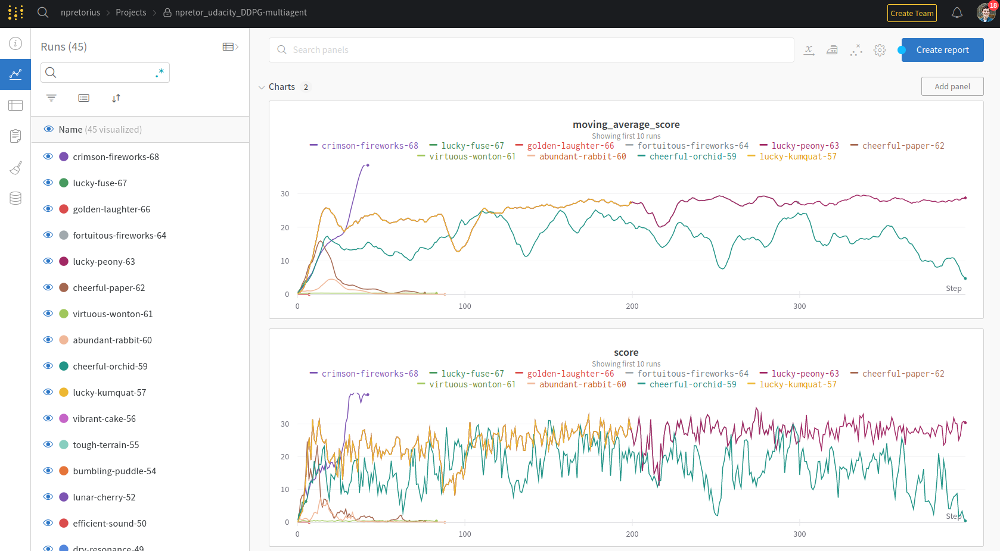

## DDPG learning algorithm walkthrough 

DDPG comes from the name Deep Deterministic Policy gradient 
For a neural network to funciton, there must a <b> continuous and differentiable</b> landscape. 

A DDPG contains a few things: 
* A <b>replay buffer</b> aka memory of what has happened. This contains the: 
  * <b>State</b> of the environment. The 33 variables corresponding to position, rotation, velocity, and angular velocities of the arm 
  * <b>Action</b> taken by the agent. This is a vector with four numbers, corresponding to torque applicable to two joints. Every entry in the action vector should be a number between -1 and 1.
  * <b>Next state</b> S prime, the resulting state of the environment after the agent selects an action
  * <b>Reward</b> The award the agent was given for the action chosen.
  * <b>Done</b> TODO 

For a multi-agent training session, you just stack all 20 of the experiences one by one into the buffer, increasing the number of experiences and the speed at which we can gather samples to start training. 

DDPG uses a rather complicated strategy to learn, as outlined below. DDPG uses 4 networks to learn
1. The <b>target actor</b> network. This network infers from the state of the environment, the optimal action to choose. This action is called A* or A-star. 
2. The <b>target critic</b> network. This network infers the Q(discounted reward) based on the state and action given to it. It takes the action from the actor, and the state of the environment, and infers a discounted reward. 
3. The <b>local critic and local actor</b> networks. These networks are slowly updated versions of the target networks, which serves to act as a method to minimize the swings caused by training on the various samples, and acts as as "noise smoother"

The actor learns to map states to ideal actions.   State -> ideal_action    
The critic learns to map actions to expected discounted_reward.  State, action -> Q(state, action)      

### How are the networks trained? 
Episodic training is used. Environment is reset and training starts. 
1. View. The environment presents a state 
2. Act. Based on that state, the actor chooses an action. This action is combined with randomness, or noise. In my implimentation, I made the actions more adjustably noisy so that the actor is more exploratory the farther away from the goal it is. The actor has an explore-exploit ratio, and i decrease that ratio as the agent converges on the goal, very similar to the adjustable learning rate that the Adam optimizer uses to adjust neural networks so they converge. 
3. Remember. The agent receives a reward and a new environment state after acting, and adds it to memory. 
4. Learn. 
   1. Get predicted actions and rewards from the target model 
   2. Using the predicted s, Q(s, a), compute the loss for the critic target network and back propagate.  
   3. Get a predicted action from the local network, and use the local critic's discounted reward calculate the loss and backpropagate.   
   4. Use the local model weights to update the target network slightly. 

## Hyperparameters
> ### Buffer size 
    The number of experiences to train on in a learning session

> ### Batch size 
    Subset batches of experiences in the buffer to learn from passed to the GPU. Limited by GPU RAM. 

> ### Gamma 
    The rate at which to discount rewards. If Gamma is 1, the agent only learns from the current experience. If it's 0.01, it learns from 100 experiences, but the experiences are discounted linearly with the oldest having the least effect on training. 

> ### Tau 
    This is the mulitplier by which the target network is updated from the actor network. Too much updating (too large of a number) and the model would be noisy. Too little, and the model would learn too slow. 

> ### Actor learning rate 
    For the Actor learning rate I set the rate to be 0.001, same as the Critic model learning rate. I experimented with higher and lower learning rates for both models, 
    and attempted to have variable learning rates between the models (ie Critic LR = 0.01 and actor = 0.001 and vice versa). Neither strategy worked, and 0.001 for
    both models proved to be the best option. The learning rate is the step size taken towards the model minima. Too large of a learning rate, and the model will not converge and will bounce around. 
    Too small of a learning rate and the model will take a very long time to converge. 

> ### Critic learning rate 
    See actor learning rate. Final value was 0.001, same as the Actor rate

> ### Weight decay 
    The L2 weight decay was set to zero which is a common method of preventing overfitting. 

> ### Number of episodes 
    Number of episodes to train before ending. 

> ### Network shape 
    The networks for the actor and critic are fully connected networks with a hidden layer(aka deep nets.  

> ### Learn every
    This tells the agent how often to learn. 

## Model architectures
This network used four neural networks per agent. Two were identical. 
Both actor and critic are fully connected networks, with one hidden layer for each. 
The critic network is unsual in that it accepts the state at the input to the first layer, 
then at the second layer it concatenates the action taken by the actor, and then has one more layer after that to map the predicted reward. 
The actor is more straightforward, it has a input layer, hidden layer, and an output layer for the output decision. 
after several issues training agents, i settled on using Leaky Relu for the activation functions of both networks, and batch normalization on the inputs of 
both networks as well

## Success and resulting plot
The model was able to reach its goal after 420 episodes with an average score across all agents of 38.487. The plot below shows steps. 
Each step is actually 10 episodes, since i didn't record the values with any finer granularity for the average scores. 
The training session was triggered so save the checkpoints and exit upon hitting the moving average success score. 

## Improvements in the future
Selectively choose better episodes (experience prioritization)  
Increase the number of agents adding experience to memory 

## Training notes (for me not the course)
Numbers are training episodes according to wandb, but some are missing due to debugging and early termination due to crashes and segfaults. Ubuntu 18 + an nvidia graphics card = disc corruption and broken package updates every few days 

Early training episodes I trained for 20. No success, no score above 4.

Tried training with single agent training, one episode reached 14, then fell down to 8 and kept falling after 5000 episodes. 

Then wrote a multi-agent training script and agent. 

(fluent-oath-2) Tried on training session for 1500, peaked at 5, then oscillated up and down between 3 and 4 with a period of about 500 episodes peak to peak. 

(noble-blaze-3) Segfault 

(fluent-dust-4) Reduced the critic and actor learning rates from 10^-3 to 10^-4, hoping this prevents oscillations. Segfault at 700 episodes

(rural-spaceships-5) Restarted training, changed gamma from 0.95 to 0.99. Peaked at 2.5 early, then gradually declined to 1. 

(charmed-wave-6) Changed to learn every 4 episodes instead of every episode. Slow linear growth up to .44. 

Found out I was not connecting the state and action into the Critic. 

(wandering-dust-32) Fixed an issue where i was training each timestep. After 250 episodes the score dropped down to 1.8 

(graceful-morning-33) Re-enabled gradient clipping. No score difference at all on the score up to 130 episodes 

(dutiful-thunder-35)  Found an issue where the noise for one agent was being added to all, resulting in non-uniform noise sampling.  

(denim-lake-37) Disabled weight decay, previously was set to zero 

(lyric-armadillo-41) Weight decay was set to 999 accidentally... 

(42) Disabled custom weight decay. Never got above 0.5

(43) Nothing LR-A 1e-4    LR-C 1e-3 

(44) Nothing LR-A 1e-3    LR-C 1e-4 

(45) LR-A 1e-3    LR-C 1e-3 

(46) Batch size 256

(47) Batch size 1024 - max is 25 

(48) Made tau larger by 10x. No learning, scores at 0.003 

(50) Changed network shape to 256-128 and 256-128 

(51) network shape is 128-64, 128-64

(54) Udacity default values. No gradient clipping 

(55) Gradient clipping for both nets 

(57, 57) Same parameters, different seed value 

(63) Trained to 4000, close to 30 but never reached

(64) Failed with SIGBART at 3000 episodes  

(65) Code bug 

(66) Code bug with noise scaling

(67) Added noise scaling which should decrease noise(explore factor) as proximity to the goal approaches. Error in noise decay rate

(68) Success. 
